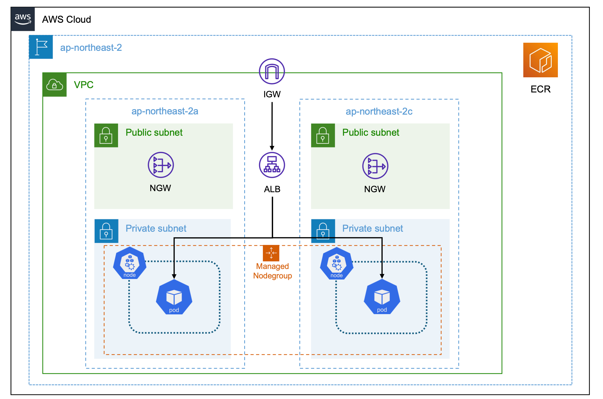

# AWS EKS Infrastructure with Terraform

## 개요

이 프로젝트는 Terraform을 사용하여 AWS에서 EKS 클러스터를 배포하는 구성입니다.  
VPC, EKS 클러스터, ECR Repository, 그리고 AWS Load Balancer Controller를 포함하여 Spring Boot 애플리케이션을 배포할 수 있는 환경을 설정합니다.

### Architecture


## 설명

**1. Terraform 설정**
* main.tf 파일에는 AWS에 EKS Cluster를 위한 기반 인프라를 생성하는 코드가 포함되어 있습니다.
* lb_controller.tf 파일에는 생성된 EKS Cluster에 AWS Load Balancer Controller를 설치하기 위한 설정이 포함되어 있습니다.
* deployment.tf 파일에는 템플릿을 참고하여 K8s 배포를 위해 ECR의 URL을 업데이트하여 deployment.yaml 파일을 생성합니다.

**2. VPC 구성**
* VPC 모듈을 사용하여 CIDR 블록 10.0.0.0/16으로 VPC를 생성합니다.
* Public Subnet과 Private Subnet이 각각 두 개씩 생성되며, NAT 게이트웨이를 통해 프라이빗 서브넷의 리소스가 외부와 통신할 수 있도록 설정됩니다.
* Private Subnet은 각각의 Reoute Table을 가지며, Reoute Table의 경로 설정으로 인해 같은 가용영역에 위치한 NAT Gateway를 통해 외부로 통신됩니다.

**3. EKS 클러스터**
* EKS 모듈을 사용하여 클러스터를 생성하고, 관리형 노드 그룹을 설정합니다.
* 노드 그룹은 t3.small 인스턴스 타입으로 생성되며, 최소 2개에서 최대 4개까지의 워크로드에 따라 자동으로 확장하거나 축소할 수 있습니다.

**4. ECR 리포지토리**
* 컨테이너 이미지를 저장할 ECR Repository를 생성합니다.

**5. AWS Load Balancer Controller**
* AWS Load Balancer Controller를 설치하기 위한 IAM 역할과 정책을 설정합니다.
* Helm을 사용하여 EKS Cluster에 AWS Load Balancer Controller를 배포합니다.

## Terraform 배포

**1. Terraform 초기화**
```bash
terraform init
```

**2. Terraform 구성 검토**
```bash
terraform plan
```

**3. Terraform 구성 배포**
```bash
terraform apply
```

## Docker 이미지 빌드 및 EKS Pod 배포

**1. Docker 이미지 빌드**
* etc/images/springboot-bae 디렉토리로 이동하여 Docker 이미지를 빌드합니다.
```bash
tar -xvf etc/Docker/springboot-bae.tar
cd etc/Docker/springboot-bae
docker buildx build --platform linux/amd64 -t <docker_image_name>:latest .
```

**2. Docker 이미지 푸시**
* ECR Repository의 인증 토큰을 검색하고 도커 클라이언트를 레지스트리에 인증합니다.
```bash
aws ecr get-login-password --region <aws-region> | docker login --username AWS --password-stdin <aws-account-id>.dkr.ecr.<aws-region>.amazonaws.com
```
* 이미지에 태그를 지정합니다.
```bash
docker tag <docker_image_id> <aws_account_id>.dkr.ecr.<region>.amazonaws.com/<my-repository>:latest
```
* ECR Repository로 푸시
```bash
docker push <aws_account_id>.dkr.ecr.<region>.amazonaws.com/<my-repository>:latest
```

**3. EKS Cluster 연결**
* kubeconfig 파일을 생성 또는 업데이트합니다.
```bash
aws eks update-kubeconfig --region <aws-region> --name <cluster-name>
```

**4. Pod 배포**
* etc/Deployment/deployment_bae.yaml 파일을 사용하여 Spring Boot 애플리케이션을 EKS 클러스터에 배포합니다.
```bash
kubectl apply -f etc/Deployment/deployment_bae.yaml
```

**5. ALB 정보 확인**
* deployment_bae.yaml로 생성된 ALB의 정보를 확인하여 웹 페이지에 접속합니다.
```bash
kubectl describe ingress springboot-ingress -n springboot-bae
kubectl get ingress -n springboot-bae
```